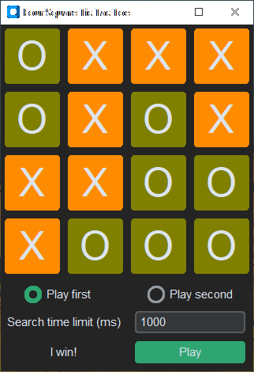

# Four Square Tic Tac Toe using Monte Carlo Tree Search

## How to play

Instead of working with a 3x3 grid, you have a 4x4.
You are still using two players; X and O.  
Play is like regular Tic Tac Toe except that players can win
three ways:

4 corners, 4 in a square (anywhere on the board) or 4 in a row (vertical,
horizontal, diagonal).

```
X . . X     . . . .     . X . .     X X X X     X . . .     . . . X
. . . .     . X X .     . X . .     . . . .     . X . .     . . X .
. . . .     . X X .     . X . .     . . . .     . . X .     . X . .
X . . X     . . . .     . X . .     . . . .     . . . X     X . . .
```


